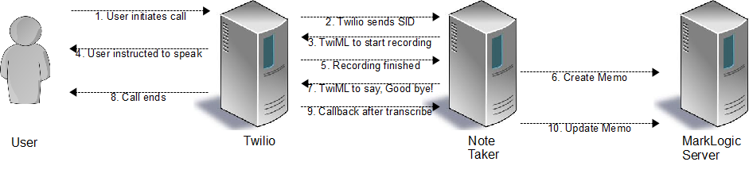

============================================
VoiceMemo Application using MarkLogic Server
============================================
:Author: Hari Krishna Dara
:Date: 15-Dec-2010

Objective
=========
Create a service that allows us to create memos by simply calling a phone number and dictating the memo. The service should transcribe the memo and store it with enough metadata to be useful to search and retrieve
using a web interface. The service should be built on top of MarkLogic Server using Twilio as the voice gateway.

Implementation
==============
There are two main parts to the system:

1. Note taker webservice that has two components

    * Voice-memo webservice, that receives actions and callbacks from Twilio
    * The Twilio voice gateway frontend that is in turn driven by ``TwiML`` generated by Voice-memo webservice

#. A MarkLogic application that allows us to browse, search and manage the stored memo's.

Note taker webservice
---------------------

The webservice provides several REST API calls for Twilio's server to use. When a user calls a pre-assigned phone number, the call is answered by Twilio and with the help of ``TwiML`` generated by callbacks to our webservice,
the user is guided through the recording process. Twilio calls our webservice first when the recording is available, and later when the transcription is ready. The webservice uses MarkLogic server to create and update memo
as Twilio makes that information available to the service. Here is a visualization of the entire process:

.. FIXME: This image is not appearing when rendered by github.com

1. User initiates call
~~~~~~~~~~~~~~~~~~~~~~

User first calls a predetermined phone number. The call is answered by Twilio and triggers the rest of the process.

2. Twilio sends SID to Note Taker
~~~~~~~~~~~~~~~~~~~~~~~~~~~~~~~~~

After the process is initiated, one of the first things Twilio does is to send a request to the "Voice URL", which is set to a predetermined URL of the Note Taker. The URL looks like this: ``http://host:port/voicememo/startmemo``.

3. Instruct user to start recording
~~~~~~~~~~~~~~~~~~~~~~~~~~~~~~~~~~~

The response back to Twilio is a ``TwiML`` document that guides the user through recording process. Here is how the XML looks like::

    <Response>
        <Say>Hello. Please start recording your memo after the beep. Press # key when done.</Say>
        <Record transcribe="true" transcribeCallback="transcribedmemo"
            action="voicememo" maxLength="30" finishOnKey="#"/>
    </Response>

4. Instruct user to speak
~~~~~~~~~~~~~~~~~~~~~~~~~

Twilio plays the message that is part of the "Say" element. When user presses the "#" key or exceeds the 30 second length, the recording ends.

5. Recording ends
~~~~~~~~~~~~~~~~~

When recording ends, Twilio sends a request to the ``http://host:port/voicememo/recordedmemo`` URL that includes the ``RecordingUrl`` and ``RecordingDuration`` parameters. The RecordingUrl can be used to download recorded audio.

6. Create memo
~~~~~~~~~~~~~~

At this point, the Note Taker webservice has the following information to add a new memo:

* Recoding of the memo
* Duration of the recording
* Timestamp (approximate)

The voice recording is retrieved from the ``RecordingUrl`` and included into the document as ``Base64`` encoded text. While inserting the memo as a new XML document in MarkLogic, the following information is used:

* The URI of the document is set to: ``/voicememo/<CallSid>.html``
* The Category of the document is set to: ``/voicememo/<From>``

7. Say, Good bye! to user
~~~~~~~~~~~~~~~~~~~~~~~~~

After the new memo has been inserted into the system, a ``TwiML`` document is returned that terminates the call gracefully. Here is how the XML looks like::

    <Response>
        <Say>Your memo has been recorded.</Say>
        <Say>Goodbye.</Say>
    </Response>

8. Call ends
~~~~~~~~~~~~

Twilio plays the message that the memo has been recorded and disconnects the call after saying goodbye.

9. Transcription is available
~~~~~~~~~~~~~~~~~~~~~~~~~~~~~

When Twilio completes the transcription of the voice message, an asynchronous request is made to the URL http://host:port/voicememo/transcribedmemo with the parameters ``TranscriptionStatus`` and ``TranscriptionText``.

10. Update Memo with transcription information
~~~~~~~~~~~~~~~~~~~~~~~~~~~~~~~~~~~~~~~~~~~~~~

If ``TranscriptionStatus`` is ``"Completed"``, the ``TranscriptionText`` is then added to the memo that is already created. The unique ``CallSid`` is used to identify the correct XML document that needs to be updated. The ``TranscriptionStatus`` is added to the document anyway, with an empty ``TranscriptionText`` as it is useful to know why a transcription is missing, if at all a message fails to transcribe.

MarkLogic Application
---------------------

<TBD>

Constructing XML Documents
--------------------------

Each voice memo is a separate XML document, and constructing XML documents by hand is not fun. Fortunately, there are many libraries to help and one such extremely easy to use library is XStream. XStream makes it easy to
serialize Java objects into XML and as a bonus, it can also deserialize them back to Java objects.

See code snippet `Serialize and Deserialize using XStream`_ to see how simple it is to use XSteram.

VoiceMemo structure
~~~~~~~~~~~~~~~~~~~

The structure of an XML document representing a voice memo is as follows::

    <voicememo>
        <recordedAt>2010-12-16T21:33:54.6173-05:00</recordedAt>
        <recordedVoiceData><![CDATA[base64]]></recordedVoiceData>
        <recordedDuration>seconds</recordedDuration>
        <transcriptionText>text</transcriptionText>
        <transcriptionStatus>status</transcriptionStatus>
    </voicememo>

Adding VoiceMemo's to MarkLogic Server
--------------------------------------

There are two distinct operations to perform while adding voice memo's.

* First, the voice memo needs to be inserted with partial information using ``xdmp:document-insert()`` function.
* Second, the same memo needs to be updated when more information (viz., transcription) is available.

There are two approaches to updating the memo:

* When an updated document is inserted with the same document URI, MarkLogic automatically overwrites the previous document with the new one. Using this approach, we would essentially do the following operations:

  - retrieve the partial document,
  - deserialize the XML using XStream to reconstruct VoiceMemo object
  - update VoiceMemo object
  - serialize the VoiceMemo back to XML using XStream
  - insert the updated XML using the same URI as the original.

* Update document to add nodes that are missing using the `xdmp:node-insert` variants.

The first approach makes it easier to work and is cleaner to work with XStream.

Building REST services
----------------------

The Note Taker is a REST based webservice that provides API's for Twilio to call into for actions and callbacks. There are several libraries that make it easier to create REST based webservices and Restlet is one of them.
The Restlet library also comes with built-in support for running an HTTP server that is good enough for most cases.

There are 3 URI's that are exposed by the Note Taker and they are:

* /voicememo/startmemo - Gets the conversation started
* /voicememo/recordedmemo - Creates the memo with voice recording information
* /voicememo/transcribedmemo - Updates the memo with transcribed message.

Each of these resources are handled by a dedicated ``ServerResource`` class.

Code snippets
=============

Serialize and Deserialize using XStream
---------------------------------------

This code shows how to serialize and deserialize using XStream::

    import com.thoughtworks.xstream.XStream;

    public class Person {
        private String firstName;
        private String lastName;
        public Person(String firstName, String lastName) {
            this.firstName = firstName;
            this.lastName = lastName;
        }
        public String toString() {
            return firstName+" "+lastName;
        }
        public static void main(String[] args) {
            XStream xstream = new XStream();
            xstream.alias("person", Person.class);
            Person p1 = new Person("Tom", "Dick");
            String xml = xstream.toXML(p1);
            System.out.println(xml);
            Person p2 = (Person) xstream.fromXML(xml);
            System.out.println(p2.toString());
        }
    }

The above, when run, will print::

    <person>
      <firstName>Tom</firstName>
      <lastName>Dick</lastName>
    </person>
    Tom Dick

Receive voice recording from Twilio
-----------------------------------

This (BeanShell [1]_) code snippet reads byte[] from URL stream::

    import java.io.ByteArrayOutputStream;
    
    url = new URL("file:///path/to/some.mp3");
    byteBuffer = new byte[4096];
    is = url.openStream();
    os = new ByteArrayOutputStream();
    while ((n = is.read(byteBuffer)) > 0) {
        os.write(byteBuffer, 0, n);
    }
    bytes = os.toByteArray();
    

Assumptions
===========

* A basic assumption that simplifies the logic a bit is that, when recording ends, Twilio's action always takes place ahead of callback for transcription. In practice this might be the actual documented behavior, but even
  otherwise, probably safe enough to assume.

External Dependencies
=====================

- Restlet
- log4j
- xstream

.. [1] BeanShell is a Java source interpreter, availble from http://www.beanshell.org
